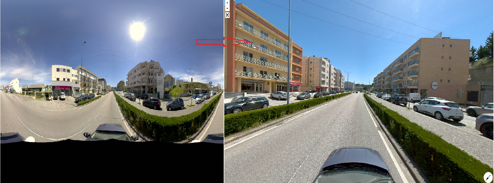
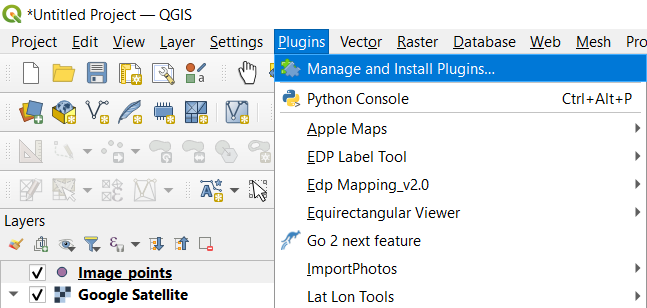
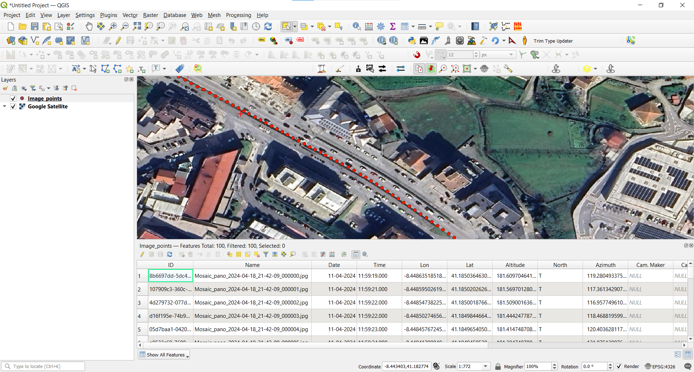

# Panoramic-360-View

##  About

This project focuses on integrating **360° panoramic images** captured from the field into **QGIS**, allowing users to:

- View panoramic imagery directly within QGIS.
- Interactively update and manage spatial information linked to each image.
- Seamlessly connect visual field data with geospatial features for enhanced analysis and decision-making.

> The goal is to bridge the gap between **field-collected visuals** and **GIS-based workflows**, improving situational awareness and data accuracy.

*Check out the attached video*

Plugin-Demo.mp4

## Development

This plugin is developed using **QGIS** and **Visual Studio Code**. It can be tested directly within QGIS using the plugin interface.

## Installation

To install the plugin manually:

1. Download the ZIP file from this repository.
2. Open QGIS.
3. Go to: `Plugins` → `Manage and Install Plugins` → `Install from ZIP`.
4. Select the downloaded ZIP file and install it.

## Usage

To use this plugin:

1. Ensure your panoramic images are **geotagged** and stored in a folder (preferably `.JPG` in equi-rectangular projection).
2. Create or load photo points in a **shapefile** (EPSG:4326 recommended) that contains:
   - A `Name` field matching each image filename.
   - Accurate coordinates for each photo location.
   - You can use the QGIS plugin **ImportPhotos** (available in the QGIS plugin repository) to generate this layer.

### Steps to Launch Viewer:

1. Click the **Panoramic-360-View** plugin icon in QGIS.
2. In the plugin panel (on the left), provide:
   - Path to the **shapefile** with photo points.
   - Path to the **folder containing images**.
3. Click on a point on the QGIS canvas and select a direction to view.
4. A fully interactive **360° panoramic image** will open in your **chrome browser** 

## Feedback & Contributions

Suggestions, issues, and contributions are welcome! Feel free to open an issue or pull request.

## Contact

- **Email**: [sachinmk1998@gmail.com](mailto:sachinmk1998@gmail.com)
- **LinkedIn**: [linkedin.com/in/sachin-kulal](http://www.linkedin.com/in/sachin-kulal)